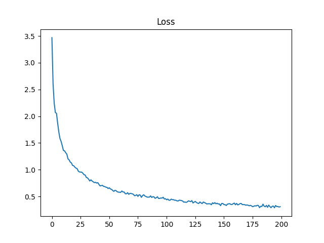
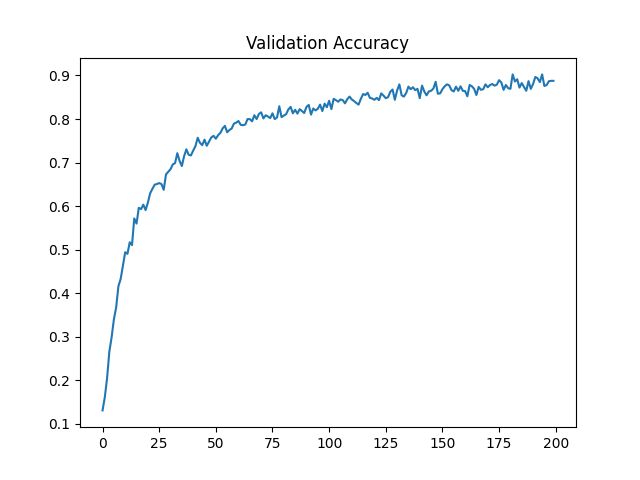

# GCN

## Graph Convolution Network

Simple implementation with Pytorch.

gnn/GCN: implementation with nn.Linear

gcn/GCNN: implementation with nn.Parameter

## Getting started

```
git clone https://github.com/jiseongHAN/GCN.git
cd GCN
pip install -r requirements.txt
```
* Train with cora datset
```
python cora.py
```

## Result
<p float="center">
    
    
</p>


## Reference
[Semi-Supervised Classification with Graph Convolutional Networks](https://arxiv.org/pdf/1609.02907.pdf)

[Collective Classification in Network Data, AI Magazine 2008](http://linqs.cs.umd.edu/projects/projects/lbc/)
